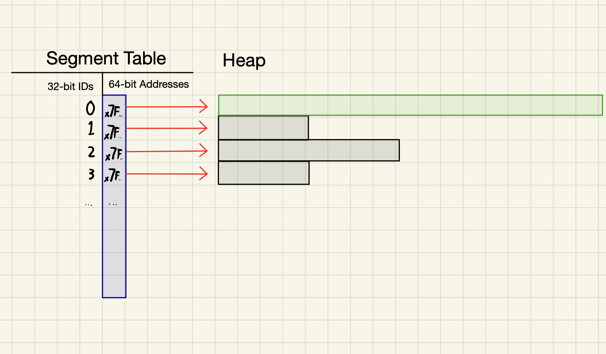
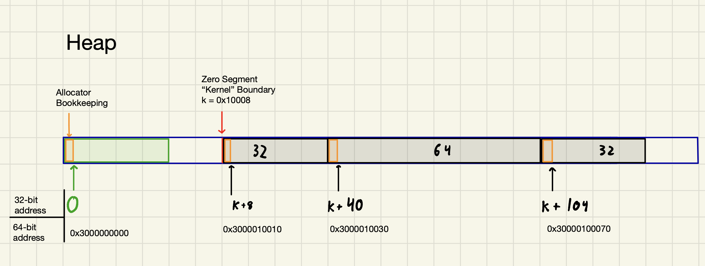

# umlang
A performance-focused compiled reimplementation of an interpreted assembly language.  

## Overview
Umlang is a RISC-style assembly language that targets the Universal Machine (UM), a 32-bit virtual machine. This language and virtual machine specification were created by Carnigie Mellon's Principles of Programming group for the 2006 International Contest on Functional Programming. The project specification and several sample UM programs are open-source under the GNU GPL v2, which also governs my project. The orignal contest details can be found at the [Ninth Annual IFCP Programming Contest website](http://www.boundvariable.org/index.shtml) and the UM spec can be found at `docs/spec/um-spec.txt`.

Here's a simple umlang program that prints "hi":
```
r1 := input()     // ASCII 'a'
r2 := 10
r3 := 1
r3 := r1 + r2   // ASCII 'h'
r2 := r2 + r3
r4 := r1 + r3   // ASCII 'i'
output r3
output r4
halt
```

The focus of this project has been accelerating the umlang runtime, and not modifying the language itself. I've implemented three different runtimes in search of maximum performance.

1. First Approach: Emulator.
    * I implemented a Universal Machine emulator in the Machine Structure and Assembly Language Programming course at Tufts (CS40).
    * This emulator effectively functions as an interpreter: it decodes umlang instructions and executes them one at a time, updating the virtual environment state each time.
    * This approach is effective, but even when aggressively profiled, leaves a lot of performance on the table.

2. Second Approach: Initial JIT compiler
    * I went back and built a significantly faster runtime with a jit compiler
    * The JIT directly translated umlang binaries into dynamically generated machine code on both ARM and x86 platforms.
    * I implemented the JIT compiler from scratch.
    * I implemented dynamic machine code generation on both ARM and x86 platforms. this means that i built my own compiler backend
    * This approach alone achieved a 3x performance improvement.
    * I also saw an opportunity to reduce address translation overhead for Universal Machine memory accesses, and assembled a hackathon team to built a 32-bit memory allocator.
    * The combination of these improvements produced a 3.5x speedup over the original emulator.

3. Third Approach: Optimized JIT compiler
    * When profiling my original JIT compiler, I observed that my program spent less than 1% of it's runtime compiling UM code, and over 99% executing UM instructions. 
    * I theorized that compiler optimizations might significantly reduce execution time. 
    * To test my theory, I went back and reimplemented the VM with an JIT compiler built on top of LLVM IR. 
    * I was able to leverage existing IR optimizations to achieve TODO performance increase.

To support the development and testing of these runtimes, I also implemented my own toolchain for umlang, including an assembler, disassembler, and testing framework.

Keep reading for a complete explanation of all the technical details, including the performance analysis of each runtime.

## Design

The UM has 8 general-purpose 32 bit registers, an instruction pointer, and maps memory segments that are each identified by a 32 bit integer. Much like real RISC-V and ARM machine code instructions, each UM machine code instruction is packed in 4 byte "words", with certain bits to identify the opcode, source and destination registers, and values to load into registers. Unlike a standard computer, the UM's memory is oriented around these 4 byte words and is not byte-addressable.

The UM recognizes 14 instructions:  
* Conditional Move  
* Addition  
* Multiplication  
* Division  
* Bitwise NAND  
* Map Memory Segment  
* Unmap Memory Segment  
* Load Register (from memory segment)  
* Store Register (into memory segment)  
* Load Immediate Value into register  
* Output register  
* Input into register   
* Halt  
* Load Program

One special memory segment mapped by the segment identifier 0 contains the UM machine code instructions that are currently being executed. The load program instruction can jump to a different point in this segment and continue executing, or can duplicate another memory segment and load it into the zero segment to be executed.

It's possible to build surprisingly complex programs from these 14 instructions and execute them in a UM runtime, including a text-based adventure game and simple OS with a file system. All CS students in the Machine Structure course at Tufts (CS40) implement an emulator-based runtime for UM programs. After implementing a working UM, students profile their program and modify it to run as fast as possible. There are many performance gains to be achieved through profiling, but the key limiting bottleneck is that the UM registers are stored in memory. This means an emulator must access memory for every single operation, limiting the performance potential of the virtual machine.

### Design Comparison: Initial JIT Compiler vs Emulator

#### JIT compilation
My UM virtual runtime uses just-in-time compilation to translate UM instructions to native machine code. The key component of the JIT compiler is that it uses 8 machine registers to store the contents of the UM registers. This accelerates the virtual runtime for two reasons:  
1. Fewer memory accesses at runtime:  
A pure emulator must access memory for every single operation. Even for a simple instruction like addition, an emulator must access registers in memory, do the addition, and store the result back into memory. Even though this oft-accessed memory lives in the L1 cache for the duration of the program, the memory access still adds a couple cycles of overhead to every single instruction.   
By contrast, the JIT compiler translate the UM addition instruction into a hardware addition instruction, using the machine registers themselves to store the contents of the virtual machine registers. This allows the same UM addition operation to be executed with a single hardware addition instruction. This keeps more of the workload between registers on the CPU, minimizing the overhead of memory accesses.

2. Instructions are translated to native machine code ahead of time:  
A pure emulator needs a large conditional statement or jump table to decode each UM instruction based on its opcode and branch to the appropriate code for handling the instruction. This requires a lot of jumping around between machine instructions to decode and execute UM instructions.  
By comparison, the JIT compiler translates UM instructions into machine code each time a new program is loaded into the zero (execution) segment. After the translation is complete, the CPU can blitz through the compiled machine instructions with minimal branching.  
Most UM instructions are compiled into pure machine code, but the more complex ones (map segment, unmap segment, input, output, and load program) are compiled into machine code that branches to handwritten assembly that subsequently calls a C function. This is done because all UM instructions must get compiled to the same number of bytes of machine code to preserve alignment, so we want to avoid bloating the standard size of a compiled UM instruction.

#### Virt32 Memory allocator

The Virt32 module provides two main features:
1. Allocate memory in a 32-bit address space. We implement our own versions of malloc, calloc, and free, providing user programs with an interface to manage memory within a virtualized 32-bit address space on a 64-bit machine.
2. Translate these 32 bit address to 64 bit address so the program user can access host machine memory from the abstraction of their 32-bit virtual address.

The easiest way to simulate a 32-bit address space is to take the 64-bit result of a `malloc()` call, choose an arbitrary 32-bit identifier, and map the 32-bit identifier to the 64-bit virtual memory address in a table. While this may be easy, it comes at the cost of performance; whenever one needs to access memory known by a 32-bit address, one must first do a table lookup to convert the 32-bit address to a real 64-bit address. The lookup is O(1), but for a perfomance-sensitive application, that's not enough: it must also be fast at the hardware level.

Our memory allocator takes a different approach. Instead of mapping arbitrary 32-bit identifiers to 64-bit memory addresses, we `mmap()` 4 Gigabytes of contiguous virtual memory and carve it up with our implementations of `malloc()` and `free()`. Our allocator treats the 64-bit address returned from the mmap() call as 32-bit address "0", and maps all future 32-bit addresses as *offsets* from that original 64-bit address. The mmaped memory doesn't change until it gets freed at the end of the program.

Consider a sample memory allocation example written in umlang:
```
r1 := 3
r2 := map_segment(r1 words)
r1 := 8
r3 := map_segment(r1 words)
r1 := 4
r4 := map_segment(r1 words)
```

The standard UM memory model will handle this in the following manner:

(In this example, the zero segment is an arbitrary size.)  
With the standard memory model, the results of these map_segment calls will be the following:
```
r2 = 1
r3 = 2
r4 = 3
```

For the same workload, consider the memory model implemented by our allocator:

With the modified memory model, the results of these map segment calls, expressed as 32-bit unsigned integers in hex, are:
```
r2 = 0x00010010
r3 = 0x00010030
r4 = 0x00010070
```

This works because these 32-bit addresses are arbitrary in the Universal Machine specification. To convert these 32-bit addresses into 64-bit addresses on the host machine, we can just add our 32-bit addresses to the base 64-bit address. To access memory at 32-bit address `0x00010010`:  
```
64 bit base address is 0x3000000000
32-bit memory address is 0x00010010

0x3000010010 = 0x3000000000 + 0x00010010
```

The key performance improvement is that all 32 to 64-bit address translations can be done with a single addition instruction instead of a memory access into an address mapping table. Even though significant portions of a frequently accessed address table would likely live in the cache for the duration of the program, accessing the L1 cache typically takes 3-5 CPU cycles on most processors, while an addition instruction can be completed in a single CPU cycle.

Not only does addition save cycles compared to memory access, but not having the address table taking up space in the cache saves cache space for the frequently accessed memory addressses themselves. This outcome is the best of both words for the Universal Machine: 32-bit addressable memory being fully supported by the hardware resources of a 64-bit machine.

Every time the UM performs a Load Register or Store Register instruction, it needs to convert the 32-bit address it wants to store a 4 byte integer at into a 64-bit memory address where the integer will actually be stored. As described above, this requires a 32-bit to 64-bit address translation followed by a memory access at the 64-bit address. Doing the address translation with addition instead of a table lookup saves the host machine a few cycles when emulating these instructions.

Saving a few cycles per instruction might not sound like much, but the Load/Store register instructions are incredibly common in many Universal Machine assembly language programs. Over hundreds of thousands of these instructions, the performance improvements adds up to a significant improvement.

Thanks to these two performance improvements, this JIT-based runtime executes UM programs up to 4.58 times faster than an aggressively profiled pure emulator on an Arm-based Macbook, and 3.5 times faster on an x86 server. See the performance section below for a full breakdown.

### Design Comparison: Optimized JIT Compiler vs Initial JIT Compiler


## Performance

I timed my emulator and JIT-compiler runtimes on the `sandmark.umz` benchmark in 4 different environments:
1. Natively on Arm64 Darwin (MacOS)
2. An Arm64 Linux environment in a Docker container on the Mac.
3. An x86-64 Linux environment in a Docker container on the Mac, emulated by Rosetta 2 (Apple's x86-64 virtualization layer).
4. Natively on an x86-64 Linux machine on the Tufts CS department servers

| Runtime  | Architecture | Compiler  | OS     | Hardware   | Time (seconds) |
| -------- | ------------ | --------- | ------ | ---------- | -------------- |
| JIT      | Arm64        | clang -O2 | Darwin | Mac M3     | 0.53           |
| Emulator | Arm64        | clang -O2 | Darwin | Mac M3     | 2.42           |
| JIT      | Arm64        | clang -O2 | Linux  | Mac M3     | 0.61           |
| Emulator | Arm64        | clang -O2 | Linux  | Mac M3     | 2.39           |
| JIT      | x86-64*      | clang -O2 | Linux  | Mac M3     | 0.76           |
| Emulator | x86-64*      | clang -O2 | Linux  | Mac M3     | 2.73           |
| JIT      | x86-64       | gcc -O2   | Linux  | Intel Xeon | 1.44           |
| Emulator | x86-64       | gcc -O2   | Linux  | Intel Xeon | 4.45           |

*Run via emulation with Rosetta 2  
All runtimes use the Virt32 memory allocator to accelerate address translations. See allocator performance below

## Allocator Performance
To test the effectiveness of our allocator, we timed a profiled Universal Machine emulator implementation running `sandmark.umz`, a performance benchmark program written in Universal Machine assembly language. Here are the times we recorded for a emulator, first using a segment table to perform address translation, and then using our memory allocator. 

| Allocator              | Architecture | Compiler  | OS     | Hardware   | Time (seconds) |
| ---------------------- | ------------ | --------- | ------ | ---------- | -------------- |
| Malloc & Segment Table | x64          | gcc -O2   | Linux  | Intel Xeon | 5.08           |
| Virt32                 | x64          | gcc -O2   | Linux  | Intel Xeon | 4.45           |

Our allocator produced a 12.4% performance improvement over a simple mapping approach!

CPU Specs:
* M3 Max Macbook (10 Performance Cores @ 4.05 GHz & 4 Efficiency Cores @ 2.80GHz)
* Intel(R) Xeon(R) Silver 4214Y CPU (6 Cores @ 2.20GHz)

Profiling Tools:
* Apple Instruments on MacOS
* Kcachegrind on Linux

Here's what I noticed:
1. Unsuprisingly, the Mac is significantly faster than the Intel machine. Even when using Rosetta 2 as an x86 virtualization layer, the Mac ran the x86 emulator and JIT runtimes nearly 2x faster than the Intel machine running x86 natively. With the Arm version of the JIT running natively on the Mac, the gap was even wider: the Mac was 3x faster.
2. The Intel machine was *very* sensitive to the `CHUNK` size (the standard size of a compiled UM instruction), which I believe to be due to higher memory latency. As a result, I aggressively cut down on chunk size, at the expense of more conditional branching in the Load Program instruction. The Mac was less sensitive to chunk size; the SOC makes memory access blazingly fast compared to the Intel machine.
3. The Mac is about 15% slower when using Rosetta 2 as the x86 translation layer. The emulator is written entirely in C without any platform-specific assembly, and thus can be compiled on any platform. This 15% estimate is based on the ratio of runtimes for the emulator compiled to Arm assembly vs the same emulator compiled to x86 assembly and run using Rosetta.
4. The JIT ran 15% faster natively on MacOS than it did in the Arm64 linux container. I still don't have a concrete explanation for this; the only hypothesis I have is that MacOS has some funny assembly conventions (like using the `ldr` instruction to load addresses) that may require some overhead to translate from the Docker container running Linux. This performance disparity didn't appear at all between the same emulator compiled on MacOS and in the Linux container, so it's hard to say what the source of the disparity could be.

## Potential Improvements and Considerations
The benchmark Universal Machine assembly language programs used to test these runtimes have a weaknesses that I exploited to make my JIT faster. If a UM program modifies iteself by storing an instruction into the zero segment it intends to execute, the JIT compiler will have undefined behavior. To handle this case, any instruction stored in the zero segment would have to be compiled into machine code, even if it never ends up being executed. I omitted this feature because it would slow the JIT down.

This feature would be relatively easy to add in both platform versions of the JIT.

1. Memory Safety: In order to be adequately performant for use with the Universal Machine, this version of the allocator does not have any memory safety built 
into its memory access interface. A less performant-sensitive application would benefit from bounds-checking measures built into this memory access interface.

2. Recycling efficiency:  
From profiling this allocator, we've determined that the biggest bottleneck in the program is recycling freed memory. The Universal Machine specification requires that all mapped segments have all bytes initialized to 0. In order to guarantee this, we must `memset` all recycled memory to 0 before it can be reallocated for use. This memset overhead was incurred every time a segment was recycled. This begged the question: what if we concurrent memsetly a recycled segment to 0 *after* the memory was freed in the first place so that when it came time to reallocate, the memory was ready for use with minimal overhead?  
We prototyped a concurrent solution, but found that the overhead of locking and unlocking mutexes alone (which was necessary to protect the integrity of the recycler data structure) was greater than the cost of the blocking `memset()`, so we decided to keep the allocator single threaded. A more creatively designed recycler could potentially handle this limitation more effectively.

3. External Fragmentation:
When the 4GB heap memory is exhausted, the allocator will refuse new allocations that cannot be served from recycled segments, even if there is enough total memory available across multiple segments. This is a classic memory allocation problem, but it doesn't affect our application very much since the UM programs we wanted to profile don't come close to exhausting a 4 GB address space. Thus, we mostly ignored it.
    
For convenience, I included a copy of the orignal UM spec in the `docs/spec/um-spec.txt` directory of this repo.

## Takeaways
This project has no practical application, but taught me a ton about computer architecture, operating systems, assembly language, and how writing performant programs.

I love working with Arm assembly & machine code. Arm has a plethora of reigsters, all instructions are encoded into 4 bytes, and three registers at a time can be used for all standard operations. This will not be my last Arm assembly project.

## Acknowledgements
Professor Mark Sheldon, for giving me the idea to make a JIT compiler for the Univeral Machine.  

Tom Hebb, for sharing a similar JIT compiler he built years ago. Tom's project had several brilliant ideas that helped me improve my original JIT compiler significantly, most notably branching from the JIT compiled machine code to hand-written assembly (written at compile time) to handle complex instructions.

Milo Goldstein, Jason Miller, Hameedah Lawal, and Yoda Ermias (my JumboHack 2025 teammates) for helping me designing and implement the Virt32 memory allocator used in this project. The archive of our original repository is here: [Virt32](https://github.com/LiamDrew/Virt32).

The JumboHack 2025 Team

Peter Wolfe, my orignal project partner for the Univeral Machine assignment. 


## TODO

- Fix Docker image package conflicts with LLVM/Clang packages for IR runtime support

Complete:
An interpreted runtime
A JIT-compiled runtime

In progress:
An assembler
A disassembler
A unit testing framework
An optimized JIT-compiled runtime based on LLVM

`runtimes/`:
interp: a UM interpreter
jit: a JIT compiler from UM binary to machine code

This directory contains the UM tools and testing framework.

/tools contains the UM assembler and disassembler
/umbinary contains many UM assembled binaries for testing

The runtest.sh script can be used to test runtimes.
The maketest.sh script can be used to compile a UM assembly program into a UM
binary and add it to the binary 

It can be used in the following way:

./umasm/test.sh [executable_name] // runs all tests

./umasm/test.sh [executable_name] [test] // runs individual test

## Running the Program
1. Download the source code.  

2. Choose a platform. There are 3 root directories: linux-x86-64-container, linux-arm64-container, and darwin-arm64. As their names suggest, the linux containers run linux on Arm64 and x86-64 platforms using docker. The darwin-arm64 directory doesn't use docker, and is intended to compile natively on an Arm-based Mac running MacOS. For darwin-arm64, skip to step 6.

3. Build the docker image:  
x86-64: ```docker buildx build --platform=linux/amd64 -t dev-tools-x86 .```  
Arm64 (Aarch64): ```docker buildx build --platform=linux/arm64 -t dev-tools-aarch64 .```  
Both containers have the utilities you need to run the program. They can each access their own `docker_shared` directory, which is shared between the container and your machine.

4. Start the docker container:  
x86-64: ```docker run --platform=linux/amd64 -it -v "$PWD/docker_shared:/home/developer/shared" dev-tools-x86```  
Arm64: ```docker run --platform=linux/arm64 -it -v "$PWD/docker_shared:/home/developer/shared" dev-tools-aarch64```
5. Navigate to the ```shared``` directory

6. Each container root directory contains the following subdirectories: `/emulator`, `/jit`, `/umasm`.  
The `/umasm` directory contains a variety of Universal Machine assembly language programs.  
The `/emulator` directory contains an executable binary of a profiled emulator-based UM virtual runtime. The binary can be run with `./um ../umasm/[program.um]`. The emulator source code is intentionally omitted since the emulator is a CS40 project   
The `/jit` directory contains the executable binary source code for the JIT compiler-based UM virtual runtime.

7. Navigate to the `/jit` directory
8. Compile with `make`
9. Run a benchmark program that executes 2 million UM instructions with `./jit umasm/sandmark.umz`

