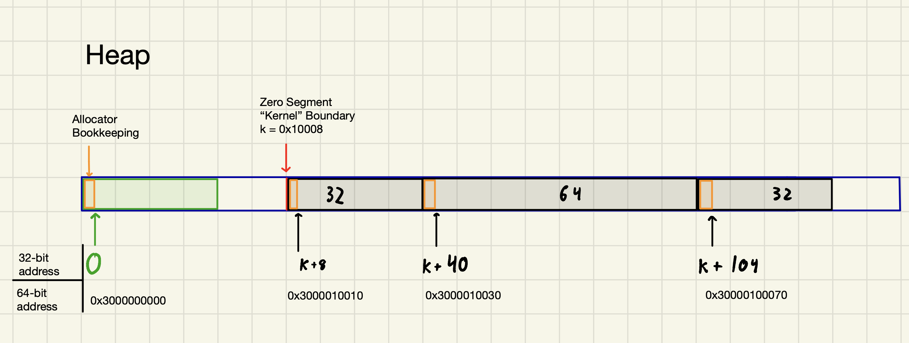

# Virt32

A memory allocator designed to accelerate address translations for 32-bit virtual machines on 64-bit systems. Developed to reduce memory access overhead for the Universal Machine, a 32-bit virtual machine with a RISC-style instruction set.

Created by Liam Drew, Hameedah Lawal, Milo Goldstein, Jason Miller, and Yoda Ermias.  
Presented at JumboHack 2025 under the Mad Hacker track.

## Overview

The Virt32 module provides two main features:
1. Allocate memory in a 32-bit address space. We implement our own versions of malloc, calloc, and free, providing user programs with an interface to manage memory within a virtualized 32-bit address space on a 64-bit machine.

2. Translate these 32 bit address to 64 bit address so the program user can access host machine memory from the abstraction of their 32-bit virtual address.

## Design

The easiest way to simulate a 32-bit address space is to take the 64-bit result of a `malloc()` call, choose an arbitrary 32-bit identifier, and map the 32-bit identifier to the 64-bit virtual memory address in a table. While this may be easy, it comes at the cost of performance; whenever one needs to access memory known by a 32-bit address, one must first do a table lookup to convert the 32-bit address to a real 64-bit address. The lookup is O(1), but for a perfomance-sensitive application, that's not enough: it must also be fast at the hardware level.

Our memory allocator takes a different approach. Instead of mapping arbitrary 32-bit identifiers to 64-bit memory addresses, we `mmap()` 4 Gigabytes of contiguous virtual memory and carve it up with our implementations of `malloc()` and `free()`. Our allocator treats the 64-bit address returned from the mmap() call as 32-bit address "0", and maps all future 32-bit addresses as *offsets* from that original 64-bit address. The mmaped memory doesn't change until it gets freed at the end of the program.

Consider a sample memory allocation example written in Universal Machine assembly language (UMASM):
```
r1 := 3
r2 := map_segment(r1 words)
r1 := 8
r3 := map_segment(r1 words)
r1 := 4
r4 := map_segment(r1 words)
```

The standard UM memory model will handle this in the following manner:

(In this example, the zero segment is an arbitrary size.)  
With the standard memory model, the results of these map_segment calls will be the following:
```
r2 = 1
r3 = 2
r4 = 3
```

For the same workload, consider the memory model implemented by our allocator:

With the modified memory model, the results of these map segment calls, expressed as 32-bit unsigned integers in hex, are:
```
r2 = 0x00010010
r3 = 0x00010030
r4 = 0x00010070
```

This works because these 32-bit addresses are arbitrary in the Universal Machine specification. To convert these 32-bit addresses into 64-bit addresses on the host machine, we can just add our 32-bit addresses to the base 64-bit address. To access memory at 32-bit address `0x00010010`:  
```
64 bit base address is 0x3000000000
32-bit memory address is 0x00010010

0x3000010010 = 0x3000000000 + 0x00010010
```

The key performance improvement is that all 32 to 64-bit address translations can be done with a single addition instruction instead of a memory access into an address mapping table. Even though significant portions of a frequently accessed address table would likely live in the cache for the duration of the program, accessing the L1 cache typically takes 3-5 CPU cycles on most processors, while an addition instruction can be completed in a single CPU cycle.

Not only does addition save cycles compared to memory access, but not having the address table taking up space in the cache saves cache space for the frequently accessed memory addressses themselves. This outcome is the best of both words for the Universal Machine: 32-bit addressable memory being fully supported by the hardware resources of a 64-bit machine.

### What is the Universal Machine?

The Universal Machine (or UM) is a simple 32 bit virtual machine with a RISC-style instruction set. The UM has 8 general-purpose 32 bit registers, an instruction pointer, and maps memory segments that are each identified by a 32 bit integer. Much like real RISC machine code instructions, each UM machine code instruction is packed in 4 byte "words", with certain bits to identify the opcode, source and destination registers, and values to load into registers.

The UM instruction set consists of the following 14 instructions:  
```
Conditional Move  
Addition  
Multiplication  
Division  
Bitwise NAND  
Map Memory Segment  
Unmap Memory Segment  
Load Register (from memory segment)  
Store Register (into memory segment)  
Load Immediate Value into register  
Output register  
Input into register  
Halt  
Load Program
```

One special memory segment mapped by the segment identifier 0 contains the UM machine code instructions that are currently being executed. The load program instruction can jump to a different point in this segment and continue executing, or can duplicate another memory segment and load it into the zero segment to be executed.

To learn more about the Universal Machine, please read the overview of [this project](https://github.com/LiamDrew/UM-JIT), which explains the Universal Machine specification and operation in more detail.

### Why does our Memory Allocator make the Universal Machine faster?

Every time the UM performs a Load Register or Store Register instruction, it needs to convert the 32-bit address it wants to store a 4 byte integer at into a 64-bit memory address where the integer will actually be stored. As described above, this requires a 32-bit to 64-bit address translation followed by a memory access at the 64-bit address. Doing the address translation with addition instead of a table lookup saves the host machine a few cycles when emulating these instructions.

Saving a few cycles per instruction might not sound like much, but the Load/Store register instructions are incredibly common in many Universal Machine assembly language programs. Over hundreds of thousands of these instructions, the performance improvements adds up to a significant improvement; see the performance section below.

## Use the Allocator
1. Navigate to `docker_shared/compact`
2. Copy files `virt.c` and `virt.h` into your project.
3. Compile and link with the rest of your program.

## Performance
To test the effectiveness of our allocator, we timed a profiled Universal Machine emulator implementation running `sandmark.umz`, a performance benchmark program written in Universal Machine assembly language. Here are the times we recorded for a emulator, first using a segment table to perform address translation, and then using our memory allocator. 

| Allocator              | Architecture | Compiler  | OS     | Hardware   | Time (seconds) |
| ---------------------- | ------------ | --------- | ------ | ---------- | -------------- |
| Malloc & Segment Table | x64          | gcc -O2   | Linux  | Intel Xeon | 5.08           |
| Virt32                 | x64          | gcc -O2   | Linux  | Intel Xeon | 4.45           |

Our allocator produced a 12.4% performance improvement over a simple mapping approach!

## Potential Improvements
1. Memory Safety: In order to be adequately performant for use with the Universal Machine, this version of the allocator does not have any memory safety built 
into its memory access interface. A less performant-sensitive application would benefit from bounds-checking measures built into this memory access interface.

2. Recycling efficiency:  
From profiling this allocator, we've determined that the biggest bottleneck in the program is recycling freed memory. The Universal Machine specification requires that all mapped segments have all bytes initialized to 0. In order to guarantee this, we must `memset` all recycled memory to 0 before it can be reallocated for use. This memset overhead was incurred every time a segment was recycled. This begged the question: what if we concurrent memsetly a recycled segment to 0 *after* the memory was freed in the first place so that when it came time to reallocate, the memory was ready for use with minimal overhead?  
We prototyped a concurrent solution, but found that the overhead of locking and unlocking mutexes alone (which was necessary to protect the integrity of the recycler data structure) was greater than the cost of the blocking `memset()`, so we decided to keep the allocator single threaded. A more creatively designed recycler could potentially handle this limitation more effectively.

3. External Fragmentation:
When the 4GB heap memory is exhausted, the allocator will refuse new allocations that cannot be served from recycled segments, even if there is enough total memory available across multiple segments. This is a classic memory allocation problem, but it doesn't affect our application very much since the UM programs we wanted to profile don't come close to exhausting a 4 GB address space. Thus, we mostly ignored it.

## Acknowledgements
CS40 Projects 6 & 7: UM & Profiling
The JumboHack 2025 Team
    
